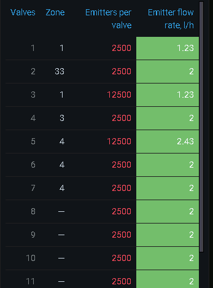

# Grafana Vtable plugin

This is the table panel for Grafana with a few features I miss in the stock Table panel.

* Horizontal and vertical orientation

  Some datasets are better displayed with the columns transformed to rows.
  It's the case for the data with a lot of columns and a few rows.
  The comparison tables are good example.

* Marking some field as the dimension
 
  This field is moved to the first row (or first column) and becomes fixed while scrolling.

* Grouping fields by label

* Stripping the units off values and showing them once at the field label
* 
  Repeating the unit in each cell adds too much clutter.

* Flexible values formatting 

  This is a case for some dates/times, bitmaps etc. Build-in Grafana unit formatter can't cover 
  all the cases. The user JS code is called to format these. And yes, you could emit HTML too.

The Vtable is built upon the CSS Grid with no virtualization used, so it works best with the
small and possible static datasets. Please use the stock Table panel for big and dynamic tables.

 
 

